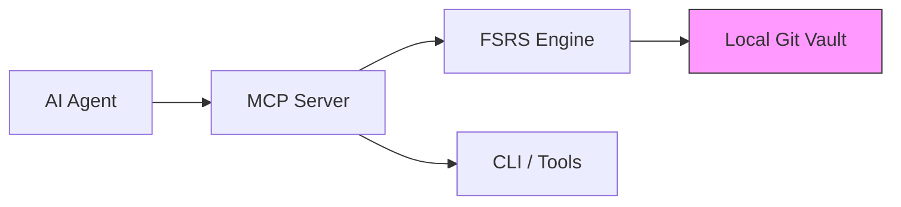

# fsrs-memory

[](https://www.npmjs.com/package/fsrs-memory)
[](https://opensource.org/licenses/MIT)
[](https://github.com/BinaryBoortsog/fsrs-memory/actions)

A compact, local-first AI long-term memory manager using FSRS scheduling and a Model Context Protocol (MCP) toolset.

Purpose: store, recall, review, and manage developer or application memories with scheduled reviews, soft-delete/purge, git-backed snapshots, and optional Anthropic summarization.

**Visual Architecture**



**Why FSRS?**

FSRS (forgetting-space repetition scheduling) surfaces only what the system is likely to forget. By filtering to items where the retrievability $R < 0.85$, the AI agent receives concise, high-priority context — saving API token costs and reducing noisy context windows.

## Key features

- FSRS-based review scheduling (ts-fsrs)
- Fuzzy duplicate detection and dependency tracking
- Soft-delete / restore / purge workflow
- Bulk operations for reviews and deletes
- Git-backed automatic backups and restore/preview/diff tools ("Git-backed Time Machine")
- Semantic diffing between snapshots
- Summarization via Anthropic (env-only API key)

## Requirements

- Node.js 18+ (or compatible LTS)
- Git (for backup/snapshot features)

## Install

Install dependencies:

```bash
npm install
```

## Environment

- `ANTHROPIC_API_KEY` — optional. Required only for the `summarize` tool.

## Data directory

By default the app stores data under your home directory in `.fsrs-memory` (for example `~/.fsrs-memory`). This contains `memories.json`, session logs, and the embedded git repository used for snapshots.

## Quick Copy-Paste: `mcp_config.json`

Use this simple MCP config snippet to register the toolset with an agent runtime:

```json
{
	"name": "fsrs-memory",
	"tools": ["remember","recall","recall_all","search","reviewed","forget","list","summarize","backup_history","backup_restore","backup_diff"]
}
```

## CLI – copy-paste commands

Show dashboard status:

```bash
node src/index.js status
```

List recent git-backed backups:

```bash
node src/index.js backup
```

Soft-delete a memory (CLI wrapper):

```bash
node src/index.js forget <memory-id> [--force]
```

Export project memories to markdown:

```bash
node src/index.js export --project my-project
```

## Project Isolation

`fsrs-memory` supports multiple isolated projects inside a single vault. Each memory is tagged with a `project` field so different applications (for example, `kooOKIE` and `Mingle`) can coexist without leaking context. Tools accept a `project` argument to scope operations and the engine only surfaces records within the requested project by default.

## Tools (MCP)

This project exposes several tools via the Model Context Protocol server. Notable tool names:
- `remember` — save a fact to long-term memory (requires `project`)
- `recall`, `recall_all` — surface fading memories
- `search` — keyword search within a project
- `reviewed`, `bulk_reviewed` — apply review ratings
- `forget`, `bulk_forget`, `restore`, `purge` — delete/restore/purge memories
- `summarize` — project summary using Anthropic
- `export` — export a project's memories to markdown
- `backup_history`, `backup_restore`, `backup_diff` — git-backed snapshot tools

See the tool definitions in [src/index.js](src/index.js).

## Backup & Git snapshots

If `git` is available, the storage layer initializes a local git repo inside the data directory and commits on saves. Use the `backup_history`, `backup_restore`, and `backup_diff` tools to inspect or restore historical snapshots.

## Testing

Run unit tests with Jest:

```bash
npm test
```

## Development notes

- Code entrypoint for MCP server: [src/index.js](src/index.js)
- Storage and git helpers: [src/storage.js](src/storage.js)
- Scheduling & search: [src/engine.js](src/engine.js)
- LLM summarize wrapper: [src/llm.js](src/llm.js)

## Contributing

See `CONTRIBUTING.md` for contribution guidelines.

## License

This project is released under the MIT License — see `LICENSE`.
